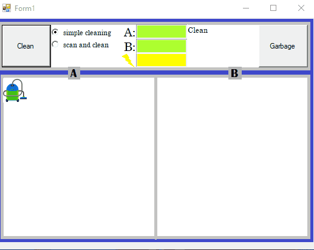

# 🤖 Smart Vacuum Cleaner (C# Windows Forms)

This project is a **schematic simulation** of how a smart vacuum cleaner works.  
It demonstrates different components and functionalities of a robotic vacuum in a **Windows Forms application**.

---

## 🎬 Demo




---

## 🛠️ Features

### 🖥️ Control & Status Panel
- **Garbage Button**: Randomly spreads garbage across the rooms.  
- **Clean Button**: Starts the cleaning process.  
- **Vacuum Mode Selector**:  
  - **Simple Cleaning** → The vacuum cleans the entire environment.  
  - **Smart Cleaning** → The environment is scanned using cameras, the exact garbage positions are detected, and the vacuum moves precisely to clean those spots.  

### 🏠 Environment Panel
- Displays rooms, the vacuum, and cameras.  
- Cameras scan the environment and send data to the vacuum for smart cleaning.  

### 📊 Progress Bars
- **Yellow Bar** → Vacuum battery charge.  
- **Other Bars** → Cleanliness percentage of each environment, which updates as the vacuum moves.  

### 🔎 Status Display
- Shows the current state of the vacuum (e.g., *Cleaning*, *Scanning*, *Idle*, etc.).  

---

## 🚀 Technologies
- **C# (.NET Framework)**  
- **Windows Forms**  
- **Visual Studio**  

---

## 📖 Getting Started

### 🔹 Prerequisites
- Visual Studio (2019 or later recommended)  
- .NET Framework (4.7.2 or later)  

### 🔹 Installation & Run
1. Clone the repository:
   ```bash
   git clone https://github.com/Arash-zihayat/Smart_vacuum_cleaner
